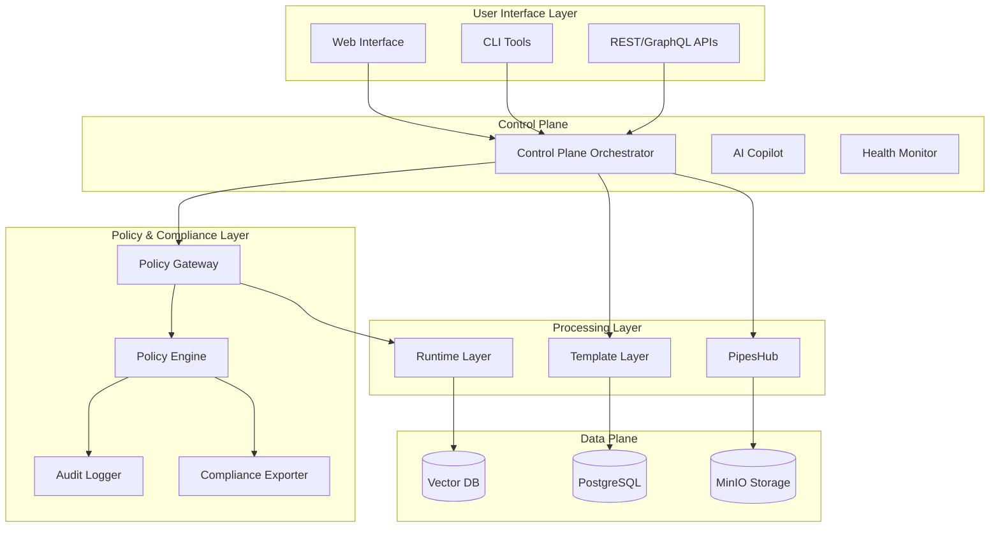
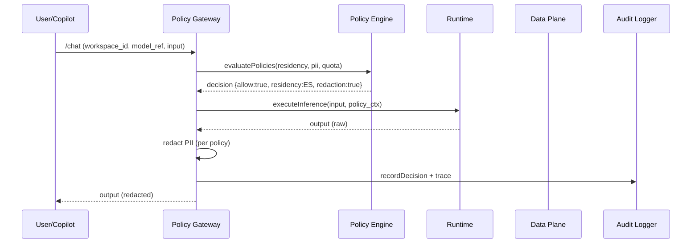
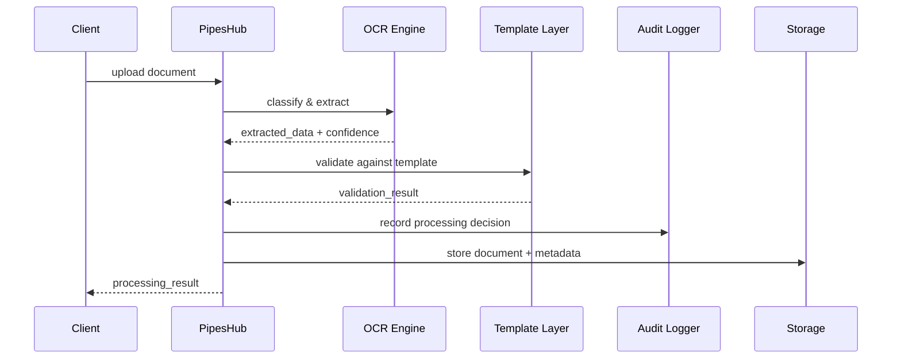
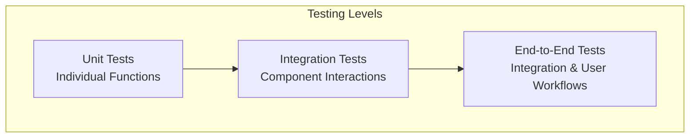

# Mobius 1 Platform Design Document

## Overview

Mobius 1 is a sovereign, private AI infrastructure platform designed specifically for Spanish gestorías and expat relocation agencies. The platform provides a complete AI stack that ensures Spain-only data residency, GDPR/EU AI Act compliance, and vendor independence while automating paperwork-heavy workflows.

The architecture follows a layered approach with clear separation of concerns, enabling rapid deployment (≤15 minutes), high availability (99.9% uptime), and comprehensive compliance capabilities.

## Requirements Traceability Matrix

| Requirement | Component Owner | Test Class | Implementation Notes |
|-------------|----------------|------------|---------------------|
| FR-001 | Control Plane + Copilot | `tests/control-plane/deployment.spec.ts` | 15min deployment with health checks |
| FR-002 | Policy Gateway + Policy Engine | `tests/policy/residency.spec.ts` | Spain-only enforcement with audit trail |
| FR-003 | PipesHub + Template Layer | `tests/pipeshub/ocr.spec.ts` | 95% OCR accuracy for Spanish docs |
| FR-004 | Policy Gateway + Policy Engine | `tests/policy/pii-redaction.spec.ts` | Real-time PII redaction in logs/responses |
| FR-005 | Control Plane + Policy Gateway | `tests/control-plane/budget.spec.ts` | Cost tracking with 80% budget alerts |
| FR-006 | Template Layer | `tests/templates/modelo-303.spec.ts` | Automated VAT return generation |
| FR-007 | Compliance Exporter | `tests/compliance/aesia-export.spec.ts` | AESIA-compliant audit packages |
| FR-008 | Control Plane | `tests/control-plane/self-healing.spec.ts` | Auto-recovery with 2min MTTR |
| FR-009 | Control Plane + Policy Engine | `tests/deployment/air-gapped.spec.ts` | Offline operation mode |
| FR-010 | Template Layer | `tests/templates/nie-tie.spec.ts` | NIE/TIE application automation |
| FR-011 | Global | `tests/security/compliance.spec.ts` | GDPR/EU AI Act compliance |
| NFR-001 | Runtime Layer + Policy Gateway | `tests/performance/latency.spec.ts` | ≤2s inference latency |
| NFR-002 | Control Plane | `tests/reliability/uptime.spec.ts` | 99.9% uptime, ≤10min MTTR |
| NFR-003 | Runtime Layer | `tests/scalability/endpoints.spec.ts` | ≥50 concurrent endpoints |
| NFR-004 | Policy Engine | `tests/policy/privacy.spec.ts` | No data egress, real-time redaction |
| NFR-005 | Compliance Exporter | `tests/compliance/audit-completeness.spec.ts` | 100% audit trail coverage |

## Architecture

### High-Level Architecture



### Critical Data Flow Sequences

#### Residency-Gated Request Flow


#### OCR Document Ingestion Flow


### Deployment Architecture

The platform supports multiple deployment modes:
- **Standard Mode**: Full connectivity with external validation
- **Spain Residency Mode**: Geo-restricted processing and storage
- **Air-Gapped Mode**: Completely offline operation

## Components and Interfaces

### Policy Gateway

**Purpose**: Central policy enforcement point for all AI model access and data processing operations.

**Key Responsibilities**:
- Request authentication and workspace isolation
- Policy evaluation (residency, PII, quotas)
- Real-time PII redaction
- Decision logging and audit trail
- Rate limiting and circuit breaking

**Interfaces**:
```typescript
interface PolicyGatewayAPI {
  chat(input: ChatRequest, ctx: RequestContext): Promise<ChatResponse>
  evaluatePolicies(ctx: RequestContext, action: string): Promise<PolicyDecision>
  checkQuota(workspaceId: string, units: number): Promise<QuotaDecision>
  recordDecision(decision: PolicyDecision, spanId: string): void
}

interface PolicyDecision {
  allow: boolean
  reasons: string[]
  residency: { allowedRegion: 'ES' | 'EU' | 'GLOBAL'; enforced: boolean }
  redaction: { applied: boolean; categories: string[] }
  quota: { remaining: number; window: string }
}

interface RequestContext {
  workspaceId: string
  userId: string
  roles: string[]
  clientIP: string
  userAgent: string
  correlationId: string
}
```

### Control Plane

**Purpose**: Central orchestration system managing deployment, configuration, and lifecycle operations.

**Key Responsibilities**:
- Infrastructure provisioning and health monitoring
- Service discovery and load balancing
- Cost tracking and budget enforcement
- Self-healing capabilities

**Interfaces**:
```typescript
interface ControlPlaneAPI {
  // Deployment Management
  deployInfrastructure(config: DeploymentConfig): Promise<DeploymentResult>
  validateDependencies(): Promise<ValidationResult>
  getHealthStatus(): Promise<HealthStatus>
  
  // Cost Management
  trackUsage(workspaceId: string, metrics: UsageMetrics): void
  setBudgetAlert(workspaceId: string, threshold: number): void
  generateCostReport(period: DateRange): Promise<CostReport>
  
  // Self-Healing
  performHealthCheck(): Promise<HealthCheckResult>
  attemptRecovery(failureType: FailureType): Promise<RecoveryResult>
}
```

### AI Copilot

**Purpose**: Natural language interface for infrastructure operations and user guidance.

**Key Responsibilities**:
- Intent interpretation and command execution
- Deployment guidance and troubleshooting
- Configuration assistance

**Interfaces**:
```typescript
interface CopilotAPI {
  processIntent(userInput: string, context: UserContext): Promise<CopilotResponse>
  guideDeployment(step: DeploymentStep): Promise<GuidanceResponse>
  provideTroubleshooting(error: SystemError): Promise<TroubleshootingGuide>
}
```

### Policy Engine

**Purpose**: Governance layer enforcing RBAC/ABAC, data residency, PII redaction, and compliance rules.

**Key Responsibilities**:
- Geographic location validation for Spain residency mode
- Real-time PII detection and redaction
- Access control and authorization
- Audit trail maintenance

**Interfaces**:
```typescript
interface PolicyEngineAPI {
  validateResidency(operation: Operation): Promise<ResidencyValidation>
  redactPII(content: string, documentType: DocumentType): Promise<RedactedContent>
  enforceAccessControl(user: User, resource: Resource, action: Action): Promise<AuthorizationResult>
  logAuditEvent(event: AuditEvent): void
}
```

### Runtime Layer

**Purpose**: Pluggable AI model execution environment supporting multiple backends.

**Key Responsibilities**:
- Model loading and inference execution
- Resource management and scaling
- Performance optimization

**Supported Backends**:
- vLLM for high-performance inference
- Ollama for local model execution
- NVIDIA NIM for enterprise deployments

**Interfaces**:
```typescript
interface RuntimeAPI {
  loadModel(modelConfig: ModelConfig): Promise<ModelInstance>
  executeInference(prompt: string, parameters: InferenceParams): Promise<InferenceResult>
  getModelMetrics(modelId: string): Promise<ModelMetrics>
}
```

### Template Layer

**Purpose**: Workflow automation system containing YAML blueprints for Spanish administrative processes.

**Key Responsibilities**:
- Document template management
- Workflow execution and validation
- Form generation and data extraction

**Interfaces**:
```typescript
interface TemplateAPI {
  validateTemplate(template: WorkflowTemplate): Promise<ValidationResult>
  executeWorkflow(templateId: string, inputData: any): Promise<WorkflowResult>
  generateForm(formType: FormType, data: FormData): Promise<GeneratedForm>
}
```

### PipesHub

**Purpose**: Document ingestion subsystem with OCR and translation capabilities.

**Key Responsibilities**:
- Document classification and processing
- OCR with ≥95% accuracy for Spanish documents
- Data extraction and validation

**Interfaces**:
```typescript
interface PipesHubAPI {
  classifyDocument(document: Document): Promise<DocumentClassification>
  extractData(document: Document): Promise<ExtractedData>
  validateExtraction(data: ExtractedData, template: Template): Promise<ValidationResult>
}
```

### Compliance Exporter

**Purpose**: Audit evidence generator for AESIA-compliant reporting.

**Key Responsibilities**:
- Audit package generation with deterministic output
- Digital signing and integrity verification
- AESIA schema compliance

**Interfaces**:
```typescript
interface ComplianceAPI {
  generateAuditPackage(timeRange: DateRange): Promise<AuditPackage>
  exportCompliance(format: ExportFormat): Promise<ComplianceReport>
  verifyIntegrity(package: AuditPackage): Promise<IntegrityResult>
}

interface AuditPackage {
  specVersion: 'aesia-1'
  orgId: string
  workspaceId: string
  period: { from: string; to: string }
  policyDecisions: PolicyDecisionRecord[]
  modelCalls: ModelCallRecord[]
  documents: DocumentRecord[]
  hashTree: string // merkle root
  signature: string // detached signature (CMS/PKCS#7)
}

interface PolicyDecisionRecord {
  id: string
  timestamp: string
  workspaceId: string
  userId: string
  decision: PolicyDecision
  context: RequestContext
  correlationId: string
}
```

## Data Models

### Identity & Tenancy

**Tenancy Model**: Row-level security with workspace isolation

```typescript
interface TenantContext {
  orgId: string
  workspaceId: string
  userId: string
  roles: string[]
}

type TenancyModel = 'schema_per_workspace' | 'row_level_security'

interface TenancyConfig {
  model: TenancyModel
  encryptionContextPerWorkspace: boolean
}
```

### Core Entities

```typescript
// User and Workspace Management
interface User {
  id: string
  email: string
  roles: Role[]
  workspaceId: string
  createdAt: Date
  lastLoginAt: Date
}

interface Workspace {
  id: string
  name: string
  organizationType: 'gestoria' | 'expat_agency' | 'other'
  spainResidencyMode: boolean
  budgetLimits: BudgetConfig
  complianceSettings: ComplianceConfig
  encryptionContext: string // per-workspace encryption key context
}

// Document Processing
interface Document {
  id: string
  workspaceId: string
  type: DocumentType
  originalName: string
  contentHash: string
  extractedData: any
  processingStatus: ProcessingStatus
  uploadedAt: Date
  processedAt?: Date
}

interface DocumentType {
  id: string
  name: string
  category: 'visa' | 'tax' | 'identity' | 'other'
  ocrTemplate: OCRTemplate
  validationRules: ValidationRule[]
}

// Template and Workflow Management
interface WorkflowTemplate {
  id: string
  name: string
  category: 'modelo_303' | 'nie_tie' | 'visa_application' | 'other'
  steps: WorkflowStep[]
  validationSchema: JSONSchema
  outputFormat: OutputFormat
}

interface WorkflowStep {
  id: string
  name: string
  type: 'data_extraction' | 'validation' | 'form_generation' | 'api_call'
  configuration: any
  dependencies: string[]
}

// Audit and Compliance
interface AuditEvent {
  id: string
  workspaceId: string
  userId: string
  eventType: AuditEventType
  resourceId: string
  action: string
  timestamp: Date
  metadata: any
  residencyValidation?: ResidencyValidation
}

interface ComplianceReport {
  id: string
  workspaceId: string
  reportType: 'aesia_audit' | 'gdpr_compliance' | 'residency_verification'
  generatedAt: Date
  timeRange: DateRange
  findings: ComplianceFinding[]
  digitalSignature: string
}
```

### Database Schema

The platform uses PostgreSQL as the primary database with the following key tables:

**Core Tables**:
- `users` - User authentication and profile information
- `workspaces` - Tenant isolation and configuration
- `documents` - Document metadata and processing status (column-level encryption for PII)
- `workflows` - Template definitions and execution history
- `audit_events` - Comprehensive audit trail (partitioned by month)
- `compliance_reports` - Generated compliance artifacts
- `policy_evaluations` - Policy engine decisions and outcomes

**Partitioning & Indexing**:
- `audit_events` partitioned by month with index on `(workspace_id, timestamp)`
- Partial index on `event_type` for policy violations
- `documents` with composite index on `(workspace_id, type, created_at)`

**Encryption Strategy**:
- Tables with PII use column-level encryption with workspace-specific keys
- Key rotation policy: quarterly for workspace keys, annually for master keys
- MinIO server-side encryption with envelope keys

**Vector Database (Qdrant)**:
- Collection naming: `workspace_{workspace_id}_{collection_type}`
- HNSW parameters: M=16, efConstruction=200 for optimal performance
- Per-workspace isolation with separate collections

## Error Handling

### Error Classification

```typescript
enum ErrorType {
  VALIDATION_ERROR = 'validation_error',
  POLICY_VIOLATION = 'policy_violation',
  RESIDENCY_VIOLATION = 'residency_violation',
  BUDGET_EXCEEDED = 'budget_exceeded',
  SYSTEM_ERROR = 'system_error',
  EXTERNAL_SERVICE_ERROR = 'external_service_error'
}

interface SystemError {
  type: ErrorType
  code: string
  message: string
  details: any
  timestamp: Date
  correlationId: string
  recoverable: boolean
}
```

### Error Handling Strategy

1. **Graceful Degradation**: Non-critical failures should not impact core functionality
2. **Circuit Breaker Pattern**: Prevent cascade failures in external service calls
3. **Retry Logic**: Exponential backoff for transient failures
4. **User-Friendly Messages**: Clear, actionable error messages for end users
5. **Audit Trail**: All errors logged with sufficient context for debugging

### Recovery Mechanisms

- **Automatic Recovery**: Self-healing for common infrastructure issues
- **Manual Intervention**: Clear escalation paths for complex failures
- **Rollback Capabilities**: Safe rollback for failed deployments or updates
- **Health Checks**: Continuous monitoring with automated remediation

## Testing Strategy

### Testing Pyramid



### Test Categories

**Unit Tests (≥80% coverage)**:
- Policy engine rule evaluation
- Document classification algorithms
- Template validation logic
- PII redaction functions
- Cost calculation methods

**Integration Tests**:
- Database operations and migrations
- External service integrations
- Workflow execution end-to-end
- Authentication and authorization flows
- Compliance report generation

**End-to-End Tests**:
- Complete deployment scenarios
- User workflow simulations
- Disaster recovery procedures
- Performance benchmarks
- Security penetration testing

### Compliance Testing

**AESIA Compliance**:
- Audit trail completeness verification
- Data residency validation
- AI decision transparency testing

**GDPR Compliance**:
- PII redaction accuracy
- Data subject rights implementation
- Consent management workflows

**Performance Testing**:
- Load testing for 50+ concurrent endpoints
- Latency benchmarks (≤2s for 1k-token prompts)
- Resource utilization under stress

### Test Automation

- **CI/CD Integration**: All tests run on every commit
- **Nightly Regression**: Comprehensive test suite execution
- **Performance Monitoring**: Continuous performance regression detection
- **Security Scanning**: Automated vulnerability assessment

## Security Considerations

### Data Protection

- **Encryption at Rest**: AES-256 for all stored data
- **Encryption in Transit**: TLS 1.3 for all communications
- **Key Management**: Hardware Security Module (HSM) integration
- **PII Redaction**: Real-time detection and redaction in logs and traces

### Access Control

- **Zero Trust Architecture**: Verify every request regardless of source
- **Role-Based Access Control (RBAC)**: Granular permission management
- **Attribute-Based Access Control (ABAC)**: Context-aware authorization
- **Multi-Factor Authentication**: Required for administrative access

### Supply Chain Security

- **Software Bill of Materials (SBOM)**: Generated for every build
- **Artifact Signing**: All deployable artifacts cryptographically signed
- **Dependency Scanning**: Continuous vulnerability monitoring
- **SLSA Level 2**: Minimum supply chain security compliance

### Network Security

- **Network Segmentation**: Isolated networks for different components
- **Firewall Rules**: Restrictive ingress/egress policies
- **VPN Access**: Secure remote access for administrators
- **DDoS Protection**: Rate limiting and traffic analysis

## Observability & Monitoring

### OpenTelemetry Instrumentation

**Span Attributes per Layer**:
- `policy.residency_decision=true/false`
- `pii.redacted=true/false`
- `workspace_id`
- `model_ref`
- `quota_bucket`
- `processing_time_ms`

**Redaction Policy**: PII redaction occurs before span/log export to guarantee no raw PII leaves the process.

**Log Retention**: 
- Audit logs: 7 years (compliance requirement)
- Application logs: 90 days
- Performance metrics: 1 year

### Service Level Indicators (SLIs) & Objectives (SLOs)

| Component | SLI | SLO | Alerting Threshold |
|-----------|-----|-----|-------------------|
| Policy Gateway | p95 latency | ≤ 150ms (no inference) | > 200ms |
| Runtime Layer | p95 inference latency | ≤ 2s for 1k tokens | > 3s |
| PipesHub | OCR classification time | ≤ 10s | > 15s |
| Control Plane | Health check response | ≤ 5s | > 10s |
| Overall System | Availability | 99.9% | < 99.5% |

### Backpressure & Circuit Breakers

- **Queue Limits**: 1000 requests per service
- **429 Strategy**: Exponential backoff with jitter
- **Circuit Breaker**: Open after 5 consecutive failures, half-open after 30s

## Air-Gapped Deployment

### Offline Bundle Format

**Bundle Contents**:
- Container images with all dependencies
- SBOM (Software Bill of Materials)
- Cryptographic checksums (SHA-256)
- Model weights and configurations
- Trust chain certificates

**Signing & Verification**:
- Bundle signed with organization's private key
- Verification against trusted public key during deployment
- Rollback capability to previous verified bundle

**Update Process**:
1. Generate signed bundle in connected environment
2. Transfer via secure media (encrypted USB, etc.)
3. Verify signature and integrity
4. Deploy with automatic rollback on failure

## API Design Standards

### REST API Conventions

**Versioning**: `/v1` path prefix with deprecation policy
**Error Codes**: Machine-readable error codes with human-readable messages
**Pagination**: Cursor-based pagination for large datasets
**Idempotency**: `Idempotency-Key` header for mutating operations
**Rate Limiting**: `X-RateLimit-*` headers with `Retry-After`

### Error Taxonomy

```typescript
enum APIErrorCode {
  VALIDATION_ERROR = 'E001',
  POLICY_VIOLATION = 'E002',
  RESIDENCY_VIOLATION = 'E003',
  QUOTA_EXCEEDED = 'E004',
  SYSTEM_ERROR = 'E500',
  EXTERNAL_SERVICE_ERROR = 'E503'
}

interface APIError {
  code: APIErrorCode
  message: string
  details?: any
  correlationId: string
  timestamp: string
}
```

## Configuration & Secrets Management

### Environment Configuration

- **Development**: `.env` files with validation
- **Production**: Vault integration for secrets
- **Air-Gapped**: Sealed Secrets with local key management

### Secret Rotation

- **Database credentials**: Monthly rotation
- **API keys**: Quarterly rotation
- **Encryption keys**: Annual rotation with backward compatibility

## Performance Optimization

### Caching Strategy

- **Redis Cluster**: Distributed caching for frequently accessed data
- **CDN Integration**: Static asset delivery optimization
- **Database Query Optimization**: Indexed queries and connection pooling
- **Model Caching**: Pre-loaded models for faster inference

### Scalability Patterns

- **Horizontal Scaling**: Auto-scaling based on demand
- **Load Balancing**: Intelligent request distribution
- **Database Sharding**: Partition data across multiple instances
- **Microservices Architecture**: Independent scaling of components

### Resource Management

- **GPU Scheduling**: Efficient allocation for AI workloads
- **Memory Management**: Optimized memory usage for large models
- **Storage Tiering**: Hot/warm/cold data classification
- **Cost Optimization**: Resource usage monitoring and optimization

### Content Handling

**Document Deduplication**: Content hashing with reference counting
**OCR Benchmark**: 200-document test set (DNI, TIE, padrón, empadronamiento certificates)
**Failure Modes**: Retry with exponential backoff, circuit breaker for external OCR services

This design provides a comprehensive foundation for implementing the Mobius 1 platform while ensuring all functional and non-functional requirements are addressed through a secure, scalable, and compliant architecture.