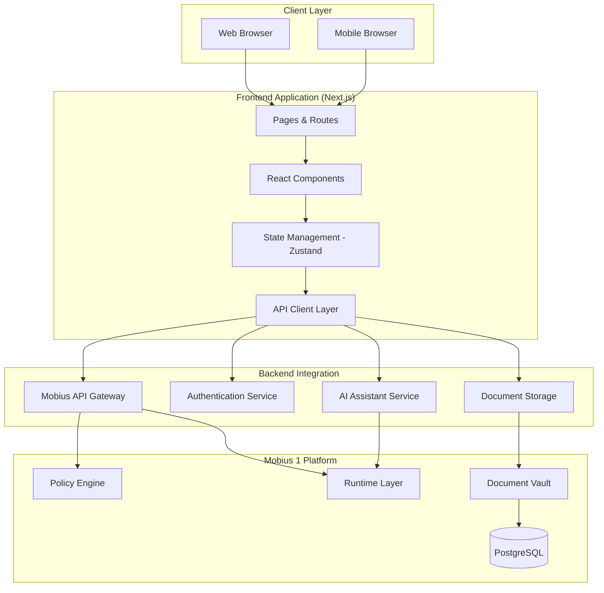
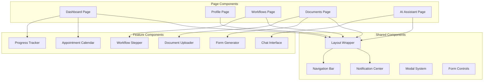
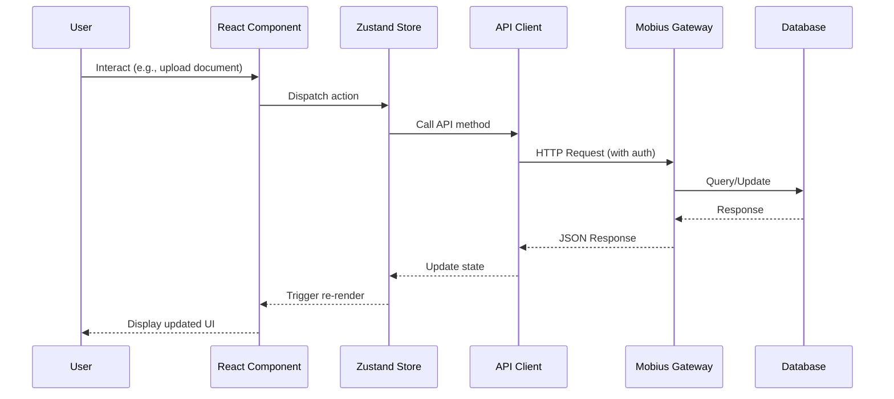

# US to Spain Migration Consumer UI - Design Document

## Overview

The US to Spain Migration Consumer UI is a Next.js-based web application that provides an intuitive, guided experience for US expats navigating the complex process of relocating to Spain. The application sits atop the Mobius 1 platform infrastructure, leveraging its AI capabilities, policy enforcement, and compliance features while presenting a consumer-friendly interface.

The design emphasizes progressive disclosure, contextual guidance, and visual progress tracking to reduce the cognitive load associated with international migration. The architecture follows modern React patterns with TypeScript, integrates with the Mobius 1 backend via REST APIs, and provides a responsive, accessible experience across devices.

### Design Philosophy: Simple, Magical, Functional

Inspired by Steve Jobs' approach to product design, this application prioritizes:

**Simplicity**:
- Remove unnecessary complexity and cognitive load
- Focus on essential features that deliver maximum value
- Use progressive disclosure to reveal complexity only when needed
- Minimize the number of steps required to complete tasks
- Clear visual hierarchy guides users naturally through workflows

**Magical Experience**:
- Anticipate user needs before they ask (intelligent recommendations)
- Provide smart defaults based on user context
- Use smooth, purposeful animations that enhance understanding
- Make complex processes feel effortless through automation
- Delight users with thoughtful micro-interactions

**Functionality**:
- Every feature must serve a clear purpose
- Prioritize reliability and correctness over feature quantity
- Ensure the application works flawlessly for core use cases
- Focus on doing a few things exceptionally well

**Implementation Principles**:
1. **Clarity over cleverness**: Clear, straightforward interactions trump clever but confusing ones
2. **Consistency**: Similar actions work the same way throughout the application
3. **Immediate feedback**: Provide clear feedback for all user actions within 100ms
4. **Forgiveness**: Allow users to undo actions and recover from mistakes easily
5. **Focus**: Guide users toward their goals without distractions
6. **Whitespace**: Use generous whitespace to create breathing room and focus attention
7. **Typography**: Use clear, readable typography with appropriate hierarchy
8. **Motion**: Use animation purposefully to guide attention and provide feedback, never for decoration

## Architecture

### High-Level Architecture



### Component Architecture



### Data Flow Architecture



## Components and Interfaces

### Frontend Components

#### Dashboard Component

**Purpose**: Central hub displaying user progress, upcoming tasks, and quick actions.

**Key Features**:
- Progress overview with completion percentages
- Upcoming appointments and deadlines
- Quick access to active workflows
- Recent activity feed
- Cost summary

**Props Interface**:
```typescript
interface DashboardProps {
  userId: string
  workspaceId: string
}

interface DashboardData {
  overallProgress: number
  activeWorkflows: WorkflowSummary[]
  upcomingAppointments: Appointment[]
  recentActivity: ActivityItem[]
  costSummary: CostSummary
}
```

#### Workflow Stepper Component

**Purpose**: Guides users through multi-step migration workflows with clear progress indication.

**Key Features**:
- Step-by-step navigation
- Progress persistence
- Conditional step display based on user inputs
- Validation before step progression
- Help tooltips and contextual guidance

**Props Interface**:
```typescript
interface WorkflowStepperProps {
  workflowType: WorkflowType
  currentStep: number
  onStepComplete: (stepId: string, data: any) => Promise<void>
  onStepBack: () => void
}

interface WorkflowStep {
  id: string
  title: string
  description: string
  component: React.ComponentType<StepComponentProps>
  validation: ValidationSchema
  prerequisites: string[]
  estimatedTime: number
}
```

#### Document Uploader Component

**Purpose**: Handles secure document upload with drag-and-drop, preview, and automatic classification.

**Key Features**:
- Drag-and-drop file upload
- File type validation
- Image preview and PDF rendering
- Upload progress indication
- Automatic document classification
- OCR extraction status

**Props Interface**:
```typescript
interface DocumentUploaderProps {
  acceptedTypes: string[]
  maxFileSize: number
  onUploadComplete: (document: UploadedDocument) => void
  onUploadError: (error: UploadError) => void
  category?: DocumentCategory
}

interface UploadedDocument {
  id: string
  filename: string
  type: DocumentType
  uploadedAt: Date
  extractedData?: ExtractedData
  ocrStatus: 'pending' | 'processing' | 'complete' | 'failed'
}
```

#### Form Generator Component

**Purpose**: Generates pre-filled Spanish administrative forms from user data and documents.

**Key Features**:
- Template-based form generation
- Auto-fill from user profile and documents
- Field validation with Spanish regulatory rules
- Missing data highlighting
- PDF export with official formatting

**Props Interface**:
```typescript
interface FormGeneratorProps {
  formType: SpanishFormType
  userId: string
  onGenerate: (formData: GeneratedForm) => Promise<void>
}

interface GeneratedForm {
  formType: SpanishFormType
  fields: FormField[]
  missingFields: string[]
  validationStatus: ValidationStatus
  pdfUrl?: string
}

interface FormField {
  id: string
  label: string
  value: string | number | Date
  source: 'profile' | 'document' | 'manual'
  validated: boolean
}
```

#### AI Assistant Chat Interface

**Purpose**: Conversational interface for asking questions and receiving personalized guidance.

**Key Features**:
- Real-time message streaming
- Conversation history
- Source citations
- Context awareness
- Suggested questions
- Copy/share responses

**Props Interface**:
```typescript
interface ChatInterfaceProps {
  userId: string
  workspaceId: string
  initialContext?: ConversationContext
}

interface Message {
  id: string
  role: 'user' | 'assistant'
  content: string
  timestamp: Date
  sources?: Source[]
  confidence?: number
}

interface ConversationContext {
  workflowType?: WorkflowType
  currentStep?: string
  recentDocuments?: string[]
}
```

### Backend API Interfaces

#### User Profile API

```typescript
interface UserProfileAPI {
  // Profile Management
  createProfile(data: ProfileCreationData): Promise<UserProfile>
  getProfile(userId: string): Promise<UserProfile>
  updateProfile(userId: string, updates: Partial<UserProfile>): Promise<UserProfile>
  
  // Workflow Recommendations
  getRecommendedWorkflows(userId: string): Promise<WorkflowRecommendation[]>
}

interface UserProfile {
  id: string
  email: string
  fullName: string
  currentLocation: string
  targetRegion: SpanishRegion
  visaTypeInterest: VisaType[]
  migrationTimeline: Date
  preferences: UserPreferences
  createdAt: Date
  updatedAt: Date
}

interface WorkflowRecommendation {
  workflowType: WorkflowType
  priority: 'high' | 'medium' | 'low'
  reason: string
  estimatedDuration: number
}
```

#### Workflow API

```typescript
interface WorkflowAPI {
  // Workflow Management
  getWorkflow(workflowId: string): Promise<Workflow>
  listUserWorkflows(userId: string): Promise<WorkflowSummary[]>
  startWorkflow(userId: string, workflowType: WorkflowType): Promise<Workflow>
  updateWorkflowStep(workflowId: string, stepId: string, data: any): Promise<WorkflowStep>
  completeWorkflow(workflowId: string): Promise<CompletionSummary>
  
  // Progress Tracking
  getProgress(userId: string): Promise<ProgressData>
}

interface Workflow {
  id: string
  userId: string
  type: WorkflowType
  status: 'not_started' | 'in_progress' | 'completed' | 'blocked'
  currentStepId: string
  steps: WorkflowStep[]
  progress: number
  startedAt: Date
  completedAt?: Date
  estimatedCompletion?: Date
}

interface ProgressData {
  overallProgress: number
  workflowProgress: Map<WorkflowType, number>
  completedTasks: number
  totalTasks: number
  upcomingDeadlines: Deadline[]
}
```

#### Document API

```typescript
interface DocumentAPI {
  // Document Management
  uploadDocument(file: File, metadata: DocumentMetadata): Promise<Document>
  getDocument(documentId: string): Promise<Document>
  listDocuments(userId: string, filters?: DocumentFilters): Promise<Document[]>
  deleteDocument(documentId: string): Promise<void>
  
  // OCR and Extraction
  getExtractionStatus(documentId: string): Promise<ExtractionStatus>
  getExtractedData(documentId: string): Promise<ExtractedData>
  
  // Document Export
  exportDocuments(userId: string, options: ExportOptions): Promise<ExportPackage>
}

interface Document {
  id: string
  userId: string
  filename: string
  type: DocumentType
  category: DocumentCategory
  contentHash: string
  uploadedAt: Date
  extractedData?: ExtractedData
  ocrStatus: OCRStatus
  encryptionKeyId: string
}

interface ExtractedData {
  documentType: DocumentType
  fields: Record<string, any>
  confidence: number
  extractedAt: Date
}
```

#### Form Generation API

```typescript
interface FormGenerationAPI {
  // Form Generation
  generateForm(userId: string, formType: SpanishFormType): Promise<GeneratedForm>
  validateForm(formData: FormData): Promise<ValidationResult>
  exportFormPDF(formId: string): Promise<Blob>
  
  // Form Templates
  listAvailableForms(): Promise<FormTemplate[]>
  getFormTemplate(formType: SpanishFormType): Promise<FormTemplate>
}

interface FormTemplate {
  type: SpanishFormType
  name: string
  description: string
  requiredDocuments: DocumentType[]
  requiredFields: string[]
  officialFormat: string
  validationRules: ValidationRule[]
}

interface ValidationResult {
  valid: boolean
  errors: ValidationError[]
  warnings: ValidationWarning[]
  completeness: number
}
```

#### AI Assistant API

```typescript
interface AIAssistantAPI {
  // Conversation
  sendMessage(userId: string, message: string, context?: ConversationContext): Promise<AssistantResponse>
  streamMessage(userId: string, message: string, context?: ConversationContext): AsyncIterator<MessageChunk>
  getConversationHistory(userId: string, limit?: number): Promise<Message[]>
  clearConversation(userId: string): Promise<void>
}

interface AssistantResponse {
  messageId: string
  content: string
  sources: Source[]
  confidence: number
  suggestedFollowUps: string[]
  timestamp: Date
}

interface Source {
  type: 'regulation' | 'official_website' | 'knowledge_base'
  title: string
  url?: string
  excerpt: string
}
```

#### Appointment API

```typescript
interface AppointmentAPI {
  // Appointment Management
  createAppointment(userId: string, data: AppointmentData): Promise<Appointment>
  getAppointment(appointmentId: string): Promise<Appointment>
  listAppointments(userId: string, filters?: AppointmentFilters): Promise<Appointment[]>
  updateAppointment(appointmentId: string, updates: Partial<AppointmentData>): Promise<Appointment>
  deleteAppointment(appointmentId: string): Promise<void>
  
  // Reminders
  getUpcomingReminders(userId: string): Promise<Reminder[]>
  markAppointmentComplete(appointmentId: string, notes?: string): Promise<void>
}

interface Appointment {
  id: string
  userId: string
  type: AppointmentType
  title: string
  date: Date
  time: string
  location: string
  requiredDocuments: DocumentType[]
  notes?: string
  status: 'scheduled' | 'completed' | 'cancelled' | 'rescheduled'
  reminders: Reminder[]
  createdAt: Date
}

interface Reminder {
  id: string
  appointmentId: string
  sendAt: Date
  sent: boolean
  channel: 'email' | 'in_app' | 'sms'
}
```

## Data Models

### Core Domain Models

```typescript
// User and Profile
interface UserProfile {
  id: string
  email: string
  fullName: string
  dateOfBirth: Date
  nationality: string
  passportNumber: string
  currentLocation: string
  targetRegion: SpanishRegion
  visaTypeInterest: VisaType[]
  migrationTimeline: Date
  languagePreference: 'en' | 'es'
  preferences: UserPreferences
  createdAt: Date
  updatedAt: Date
}

interface UserPreferences {
  notificationChannels: NotificationChannel[]
  notificationFrequency: 'immediate' | 'daily' | 'weekly'
  currency: 'USD' | 'EUR'
  timezone: string
  accessibility: AccessibilitySettings
}

// Workflow Models
type WorkflowType = 
  | 'digital_nomad_visa'
  | 'non_lucrative_visa'
  | 'student_visa'
  | 'work_visa'
  | 'nie_application'
  | 'tie_application'
  | 'empadronamiento'
  | 'social_security'
  | 'tax_registration'

interface Workflow {
  id: string
  userId: string
  type: WorkflowType
  status: WorkflowStatus
  currentStepId: string
  steps: WorkflowStep[]
  progress: number
  metadata: WorkflowMetadata
  startedAt: Date
  completedAt?: Date
  estimatedCompletion?: Date
}

interface WorkflowStep {
  id: string
  workflowId: string
  order: number
  title: string
  description: string
  type: StepType
  status: StepStatus
  data: Record<string, any>
  prerequisites: string[]
  estimatedTime: number
  completedAt?: Date
}

type StepType = 
  | 'information_gathering'
  | 'document_upload'
  | 'form_filling'
  | 'appointment_booking'
  | 'payment'
  | 'submission'
  | 'waiting'
  | 'verification'

type StepStatus = 'not_started' | 'in_progress' | 'completed' | 'blocked' | 'skipped'

// Document Models
type DocumentType =
  | 'passport'
  | 'birth_certificate'
  | 'marriage_certificate'
  | 'criminal_record'
  | 'bank_statement'
  | 'employment_letter'
  | 'diploma'
  | 'medical_certificate'
  | 'proof_of_address'
  | 'tax_return'
  | 'other'

type DocumentCategory = 'identity' | 'financial' | 'educational' | 'employment' | 'medical' | 'legal'

interface Document {
  id: string
  userId: string
  filename: string
  type: DocumentType
  category: DocumentCategory
  mimeType: string
  sizeBytes: number
  contentHash: string
  uploadedAt: Date
  expiresAt?: Date
  extractedData?: ExtractedData
  ocrStatus: OCRStatus
  encryptionKeyId: string
  tags: string[]
}

type OCRStatus = 'pending' | 'processing' | 'complete' | 'failed'

// Form Models
type SpanishFormType =
  | 'nie_application'
  | 'tie_application'
  | 'empadronamiento'
  | 'modelo_303'
  | 'modelo_111'
  | 'social_security_registration'

interface GeneratedForm {
  id: string
  userId: string
  formType: SpanishFormType
  fields: FormField[]
  missingFields: string[]
  validationStatus: ValidationStatus
  generatedAt: Date
  pdfUrl?: string
  metadata: FormMetadata
}

interface FormField {
  id: string
  name: string
  label: string
  value: string | number | Date | null
  source: 'profile' | 'document' | 'manual'
  validated: boolean
  required: boolean
  validationRules: ValidationRule[]
}

// Appointment Models
type AppointmentType =
  | 'nie_appointment'
  | 'tie_appointment'
  | 'empadronamiento_appointment'
  | 'police_station'
  | 'consulate'
  | 'tax_office'
  | 'social_security_office'
  | 'other'

interface Appointment {
  id: string
  userId: string
  type: AppointmentType
  title: string
  date: Date
  time: string
  location: AppointmentLocation
  requiredDocuments: DocumentType[]
  notes?: string
  status: AppointmentStatus
  reminders: Reminder[]
  createdAt: Date
  updatedAt: Date
}

interface AppointmentLocation {
  name: string
  address: string
  city: string
  region: SpanishRegion
  postalCode: string
  coordinates?: { lat: number; lng: number }
  contactInfo?: string
}

type AppointmentStatus = 'scheduled' | 'completed' | 'cancelled' | 'rescheduled'

// Cost Tracking Models
interface CostSummary {
  totalEstimated: Money
  totalSpent: Money
  breakdown: CostBreakdown[]
  currency: 'USD' | 'EUR'
  exchangeRate?: number
  lastUpdated: Date
}

interface CostBreakdown {
  category: CostCategory
  estimated: Money
  spent: Money
  items: CostItem[]
}

type CostCategory = 'visa_fees' | 'document_translations' | 'legal_services' | 'travel' | 'other'

interface CostItem {
  id: string
  description: string
  amount: Money
  category: CostCategory
  status: 'pending' | 'paid'
  dueDate?: Date
  paidDate?: Date
}

interface Money {
  amount: number
  currency: 'USD' | 'EUR'
}

// Regional Resources
type SpanishRegion =
  | 'madrid'
  | 'barcelona'
  | 'valencia'
  | 'seville'
  | 'malaga'
  | 'bilbao'
  | 'granada'
  | 'other'

interface RegionalResource {
  id: string
  region: SpanishRegion
  type: ResourceType
  title: string
  description: string
  content: string
  url?: string
  lastUpdated: Date
  tags: string[]
}

type ResourceType = 
  | 'administrative_office'
  | 'cultural_guide'
  | 'healthcare_info'
  | 'banking_info'
  | 'housing_info'
  | 'expat_community'
  | 'local_services'

// Notification Models
interface Notification {
  id: string
  userId: string
  type: NotificationType
  title: string
  message: string
  priority: 'low' | 'medium' | 'high' | 'urgent'
  read: boolean
  actionUrl?: string
  createdAt: Date
  expiresAt?: Date
}

type NotificationType =
  | 'deadline_reminder'
  | 'appointment_reminder'
  | 'task_completed'
  | 'document_processed'
  | 'form_ready'
  | 'system_update'
  | 'community_reply'

type NotificationChannel = 'email' | 'in_app' | 'sms'
```

### Database Schema

The application uses PostgreSQL via Prisma ORM with the following schema structure:

**Core Tables**:
- `users` - User authentication and basic info
- `user_profiles` - Extended profile information
- `workflows` - Workflow instances and state
- `workflow_steps` - Individual step data and completion status
- `documents` - Document metadata (encrypted content in MinIO)
- `generated_forms` - Form generation history and data
- `appointments` - Appointment scheduling and tracking
- `notifications` - User notifications and delivery status
- `cost_items` - Cost tracking entries
- `regional_resources` - Region-specific guides and information
- `community_posts` - Forum posts and discussions
- `audit_log` - Activity audit trail

**Indexes**:
- `users(email)` - Unique index for authentication
- `workflows(user_id, status)` - Composite index for user workflow queries
- `documents(user_id, category, uploaded_at)` - Composite index for document listing
- `appointments(user_id, date)` - Composite index for appointment queries
- `notifications(user_id, read, created_at)` - Composite index for notification center
- `audit_log(user_id, timestamp)` - Composite index for audit queries

**Relationships**:
- User → Workflows (one-to-many)
- Workflow → WorkflowSteps (one-to-many)
- User → Documents (one-to-many)
- User → Appointments (one-to-many)
- User → Notifications (one-to-many)
- User → CostItems (one-to-many)

## Error Handling

### Error Classification

```typescript
enum ErrorType {
  // Client Errors
  VALIDATION_ERROR = 'validation_error',
  AUTHENTICATION_ERROR = 'authentication_error',
  AUTHORIZATION_ERROR = 'authorization_error',
  NOT_FOUND = 'not_found',
  CONFLICT = 'conflict',
  
  // Server Errors
  INTERNAL_ERROR = 'internal_error',
  SERVICE_UNAVAILABLE = 'service_unavailable',
  GATEWAY_TIMEOUT = 'gateway_timeout',
  
  // Business Logic Errors
  WORKFLOW_ERROR = 'workflow_error',
  DOCUMENT_PROCESSING_ERROR = 'document_processing_error',
  FORM_GENERATION_ERROR = 'form_generation_error',
  
  // External Service Errors
  MOBIUS_API_ERROR = 'mobius_api_error',
  OCR_SERVICE_ERROR = 'ocr_service_error',
  AI_SERVICE_ERROR = 'ai_service_error'
}

interface ApplicationError {
  type: ErrorType
  code: string
  message: string
  userMessage: string
  details?: any
  timestamp: Date
  correlationId: string
  recoverable: boolean
  retryable: boolean
}
```

### Error Handling Strategy

**Frontend Error Handling**:
1. **Global Error Boundary**: Catches React component errors and displays fallback UI
2. **API Error Interceptor**: Handles HTTP errors and transforms them into user-friendly messages
3. **Toast Notifications**: Non-blocking error notifications for recoverable errors
4. **Error Pages**: Dedicated pages for 404, 500, and maintenance scenarios
5. **Retry Logic**: Automatic retry with exponential backoff for transient failures

**Backend Error Handling**:
1. **Validation Errors**: Return 400 with detailed field-level error messages
2. **Authentication Errors**: Return 401 with clear authentication requirements
3. **Authorization Errors**: Return 403 with explanation of required permissions
4. **Not Found Errors**: Return 404 with suggestions for valid resources
5. **Server Errors**: Return 500 with correlation ID for support tracking

**User Experience**:
- Clear, actionable error messages in plain English
- Suggestions for resolution when possible
- Contact support option with pre-filled error details
- Graceful degradation for non-critical features
- Offline mode indicators and cached data access


## Correctness Properties

*A property is a characteristic or behavior that should hold true across all valid executions of a system-essentially, a formal statement about what the system should do. Properties serve as the bridge between human-readable specifications and machine-verifiable correctness guarantees.*

### Property Reflection

After analyzing all acceptance criteria, several properties can be consolidated to eliminate redundancy:

- Properties about data persistence (profile, appointments, documents) can be unified into a general "round trip" property
- Properties about UI rendering at different screen sizes can be combined into a comprehensive responsive design property
- Properties about notification delivery across different triggers can be consolidated
- Properties about form field population and validation can be combined

The following properties represent the unique, non-redundant validation requirements:

### Property 1: Profile-based workflow recommendations

*For any* valid user profile with specified visa interests and target region, the system should return a non-empty list of recommended workflows that are relevant to the user's inputs.

**Validates: Requirements 1.2**

### Property 2: Workflow recommendation refresh performance

*For any* profile update, the system should refresh workflow recommendations and return results within 2 seconds.

**Validates: Requirements 1.3**

### Property 3: Profile validation gates workflow access

*For any* user profile, if all required fields are present and valid, the user should have access to migration workflows; if any required field is missing or invalid, access should be denied.

**Validates: Requirements 1.4**

### Property 4: Data persistence round trip

*For any* user data (profile, appointment, document metadata), when saved to the system and then retrieved, the retrieved data should match the original data.

**Validates: Requirements 1.5, 7.1**

### Property 5: Progress calculation accuracy

*For any* set of workflow tasks with completion statuses, the calculated overall progress percentage should equal the number of completed tasks divided by total tasks, multiplied by 100.

**Validates: Requirements 2.1, 2.3**

### Property 6: Task urgency categorization

*For any* task with a due date, the urgency category (overdue, due soon, upcoming, completed) should be correctly determined based on the current date and task status.

**Validates: Requirements 2.2**

### Property 7: Time estimation reasonableness

*For any* set of incomplete tasks with historical completion data, the estimated time remaining should be non-negative and proportional to the number of remaining tasks.

**Validates: Requirements 2.4**

### Property 8: Dependency ordering in timeline

*For any* set of tasks with dependencies, the timeline view should order tasks such that no task appears before its prerequisites.

**Validates: Requirements 2.5**

### Property 9: Workflow step rendering completeness

*For any* workflow type, when selected, the system should display all steps with non-empty titles and descriptions.

**Validates: Requirements 3.2, 3.4**

### Property 10: Prerequisite enforcement

*For any* workflow step with incomplete prerequisites, the system should prevent progression to that step.

**Validates: Requirements 3.3**

### Property 11: Workflow completion summary generation

*For any* workflow marked as completed, the system should generate a completion summary containing next steps.

**Validates: Requirements 3.5**

### Property 12: Document classification assignment

*For any* uploaded document, the system should assign it a document type classification and a category.

**Validates: Requirements 4.1, 4.4**

### Property 13: Document encryption round trip

*For any* uploaded document, encrypting and then decrypting with the correct workspace key should yield the original document content.

**Validates: Requirements 4.2**

### Property 14: OCR extraction accuracy

*For any* standard US document from the test set, OCR extraction should achieve at least 95% field accuracy.

**Validates: Requirements 4.3**

### Property 15: Document deletion completeness

*For any* document marked for deletion, subsequent retrieval attempts should fail with a not-found error.

**Validates: Requirements 4.5**

### Property 16: Form field population from available data

*For any* form generation request, all fields that have corresponding data in the user profile or document vault should be populated.

**Validates: Requirements 5.1**

### Property 17: Missing form field highlighting

*For any* generated form, all required fields that lack data should be included in the missing fields list.

**Validates: Requirements 5.3**

### Property 18: Form validation before download

*For any* form download request, the form should pass all validation rules before the download is allowed.

**Validates: Requirements 5.4**

### Property 19: Form PDF format compliance

*For any* generated form PDF, the document structure should match Spanish government specifications (correct fonts, layout, field positions).

**Validates: Requirements 5.5**

### Property 20: AI assistant response time

*For any* user question, the AI assistant should provide a response within 3 seconds.

**Validates: Requirements 6.1**

### Property 21: Conversation context maintenance

*For any* follow-up question within a session, the AI assistant response should reference information from previous messages in the conversation.

**Validates: Requirements 6.2**

### Property 22: Regulation citation inclusion

*For any* AI assistant response about Spanish regulations or legal requirements, the response should include at least one citation or source reference.

**Validates: Requirements 6.3**

### Property 23: Uncertainty indication

*For any* AI assistant response with confidence below a threshold, the response should explicitly indicate uncertainty and suggest consulting official sources.

**Validates: Requirements 6.4**

### Property 24: PII redaction in conversation logs

*For any* conversation containing PII (passport numbers, addresses, etc.), the stored conversation log should have all PII redacted.

**Validates: Requirements 6.5**

### Property 25: Appointment reminder scheduling

*For any* created appointment, reminder notifications should be scheduled for 7 days, 3 days, and 1 day before the appointment date.

**Validates: Requirements 7.2**

### Property 26: Past appointment prompting

*For any* appointment with a date in the past and status still "scheduled", the system should prompt the user to update the status.

**Validates: Requirements 7.3**

### Property 27: iCal export round trip

*For any* appointment, exporting to iCal format and re-importing should preserve all appointment details (date, time, location, title).

**Validates: Requirements 7.4**

### Property 28: Appointment document requirements

*For any* appointment type, the system should display a non-empty list of required documents.

**Validates: Requirements 7.5**

### Property 29: Cost estimate display

*For any* workflow, the system should display cost estimates for all applicable cost categories.

**Validates: Requirements 8.1**

### Property 30: Cost total update on payment

*For any* cost item marked as paid, the total spent amount should increase by the item's amount.

**Validates: Requirements 8.2**

### Property 31: Cost categorization correctness

*For any* cost item, it should be assigned to exactly one valid cost category.

**Validates: Requirements 8.3**

### Property 32: Expense status mutability

*For any* expense, the user should be able to change its status between "paid" and "pending".

**Validates: Requirements 8.4**

### Property 33: Currency conversion accuracy

*For any* cost amount, when displayed in both USD and EUR, the conversion should be within 1% of the actual exchange rate.

**Validates: Requirements 8.5**

### Property 34: Responsive design adaptation

*For any* UI component, when rendered at mobile (< 768px), tablet (768-1024px), and desktop (> 1024px) viewport widths, the component should be fully visible and functional without horizontal scrolling.

**Validates: Requirements 9.1, 9.2**

### Property 35: Image upload optimization

*For any* image uploaded on a mobile device, the file size should be reduced by at least 30% compared to the original while maintaining acceptable quality.

**Validates: Requirements 9.3**

### Property 36: Mobile load time performance

*For any* initial page load on a simulated 4G connection, the time to interactive should be less than 3 seconds.

**Validates: Requirements 9.5**

### Property 37: Notification delivery on events

*For any* notification-triggering event (deadline approaching, task completed, etc.), a notification should be created and delivered via the user's preferred channels.

**Validates: Requirements 10.1, 10.2**

### Property 38: Notification preference persistence

*For any* notification preference configuration, the preferences should be persisted and respected in subsequent notification deliveries.

**Validates: Requirements 10.3**

### Property 39: In-app notification persistence

*For any* in-app notification, it should remain visible in the notification center until the user explicitly acknowledges it.

**Validates: Requirements 10.4**

### Property 40: Notification batching by preference

*For any* set of non-urgent notifications, they should be batched according to the user's digest preference (daily or weekly).

**Validates: Requirements 10.5**

### Property 41: Regional resource availability

*For any* Spanish region selection, the system should display at least one resource for each resource type (administrative offices, cultural guides, etc.).

**Validates: Requirements 11.1, 11.2, 11.3, 11.4**

### Property 42: Application tracking entry creation

*For any* application submission, a tracking entry should be created with submission date and expected timeline.

**Validates: Requirements 12.1**

### Property 43: Application status mutability

*For any* application, the user should be able to update its status, and the new status should be reflected immediately.

**Validates: Requirements 12.2**

### Property 44: Processing time estimate availability

*For any* application type, the system should provide a typical processing time estimate.

**Validates: Requirements 12.3**

### Property 45: Delayed application alerting

*For any* application where current date exceeds submission date plus typical processing time, an alert should be generated.

**Validates: Requirements 12.4**

### Property 46: Application status history completeness

*For any* application with status changes, all historical status values and timestamps should be retrievable.

**Validates: Requirements 12.5**

### Property 47: Session timeout enforcement

*For any* user session, after 30 minutes of inactivity, the session should be invalidated and require re-authentication.

**Validates: Requirements 13.2**

### Property 48: GDPR data export completeness

*For any* user data export request, the exported package should include all user profile data, documents, workflow history, and audit logs.

**Validates: Requirements 13.4, 14.1**

### Property 49: Document access audit logging

*For any* access to a sensitive document, an audit log entry should be created with user ID, document ID, and timestamp.

**Validates: Requirements 13.5**

### Property 50: Export format correctness

*For any* data export, documents should be in PDF format and structured data should be in valid JSON format.

**Validates: Requirements 14.2**

### Property 51: Export performance

*For any* typical user data volume (< 100 documents, < 50 workflows), export generation should complete within 60 seconds.

**Validates: Requirements 14.3**

### Property 52: Export encryption round trip

*For any* exported package encrypted with a password, decrypting with the same password should yield the original data.

**Validates: Requirements 14.4**

### Property 53: Selective export filtering

*For any* export request with specific workflow or category filters, the exported data should contain only items matching the filters.

**Validates: Requirements 14.5**

### Property 54: Forum post creation and retrieval

*For any* user with forum access, they should be able to create a post and subsequently retrieve it.

**Validates: Requirements 15.2**

### Property 55: Post helpfulness marking

*For any* forum post, any user should be able to mark it as helpful, and the helpful count should increment.

**Validates: Requirements 15.4**

### Property 56: Reputation score calculation

*For any* user with forum contributions, their reputation score should be non-negative and increase when their posts are marked as helpful.

**Validates: Requirements 15.5**

## Testing Strategy

### Testing Approach

The application will employ a comprehensive testing strategy combining unit tests, integration tests, property-based tests, and end-to-end tests to ensure correctness and reliability.

### Unit Testing

**Framework**: Vitest for both frontend and backend unit tests

**Coverage Target**: ≥ 80% code coverage

**Focus Areas**:
- React component rendering and behavior
- State management logic (Zustand stores)
- API client methods and error handling
- Form validation functions
- Data transformation utilities
- Date/time calculations
- Currency conversion logic
- Cost calculation functions

**Example Unit Tests**:
- Profile validation logic with various invalid inputs
- Progress percentage calculation with different task states
- Task urgency categorization with various due dates
- Currency conversion with different exchange rates
- Document type classification logic

### Property-Based Testing

**Framework**: fast-check (JavaScript/TypeScript property-based testing library)

**Configuration**: Each property test should run a minimum of 100 iterations to ensure comprehensive input coverage.

**Tagging Convention**: Each property-based test MUST include a comment tag in this exact format:
```typescript
// Feature: us-to-spain-consumer-ui, Property {number}: {property_text}
```

**Focus Areas**:
- Data persistence round trips (profiles, documents, appointments)
- Form generation with various user data combinations
- Workflow progression with different prerequisite states
- Cost calculations with various expense combinations
- Notification scheduling with different date ranges
- Responsive design at various viewport sizes
- Export/import round trips for various data types

**Example Property Tests**:
- **Property 4**: For any user profile data, save then retrieve should return identical data
- **Property 13**: For any document, encrypt then decrypt should return original content
- **Property 27**: For any appointment, export to iCal then import should preserve all fields
- **Property 52**: For any export package, encrypt with password then decrypt should return original data

### Integration Testing

**Framework**: Vitest with test server setup

**Focus Areas**:
- API endpoint integration with Mobius backend
- Authentication and authorization flows
- Document upload and OCR processing
- Form generation end-to-end
- AI assistant conversation flows
- Notification delivery system
- Database operations and transactions

**Example Integration Tests**:
- Complete user registration and profile creation flow
- Document upload, classification, and OCR extraction
- Workflow progression from start to completion
- Form generation with real user data and documents
- AI assistant multi-turn conversation
- Appointment creation and reminder scheduling

### End-to-End Testing

**Framework**: Chrome DevTools MCP for browser automation and testing

**Why Chrome DevTools MCP**:
- Direct integration with Chrome DevTools Protocol
- Real browser testing with actual rendering engine
- Network inspection and performance profiling
- Screenshot and snapshot capabilities for visual regression
- Console log monitoring for runtime errors
- Accessibility tree inspection

**Focus Areas**:
- Critical user journeys across the entire application
- Cross-browser compatibility (Chrome, Firefox, Safari, Edge)
- Mobile responsive behavior
- Performance benchmarks
- Accessibility compliance (WCAG 2.1 Level AA)
- Visual regression testing with screenshots
- Network performance and API call verification

**Example E2E Tests**:
- New user onboarding: registration → profile setup → first workflow
- Document management: upload → classify → use in form generation
- Visa application workflow: start → complete all steps → generate forms
- AI assistant usage: ask question → receive response → follow-up question
- Mobile experience: navigate app → upload document → view progress
- Visual regression: compare screenshots across deployments
- Performance profiling: measure Core Web Vitals during user flows

### Performance Testing

**Tools**: Lighthouse, WebPageTest, custom performance monitoring

**Metrics**:
- Time to First Byte (TTFB) < 600ms
- First Contentful Paint (FCP) < 1.8s
- Largest Contentful Paint (LCP) < 2.5s
- Time to Interactive (TTI) < 3.8s
- Cumulative Layout Shift (CLS) < 0.1

**Load Testing**:
- Simulate 10,000 concurrent users
- Measure response times under load
- Identify bottlenecks and optimization opportunities

### Accessibility Testing

**Tools**: axe-core, WAVE, manual keyboard navigation testing

**Standards**: WCAG 2.1 Level AA compliance

**Focus Areas**:
- Keyboard navigation for all interactive elements
- Screen reader compatibility
- Color contrast ratios
- Focus indicators
- ARIA labels and roles
- Form field labels and error messages

### Security Testing

**Focus Areas**:
- Authentication and session management
- Authorization and access control
- Input validation and sanitization
- XSS prevention
- CSRF protection
- Secure data transmission (TLS 1.3)
- PII redaction in logs

**Tools**: OWASP ZAP, npm audit, Snyk

## Security Considerations

### Authentication and Authorization

**Authentication**:
- OAuth 2.0 / OIDC integration with Mobius platform
- Multi-factor authentication (MFA) support
- Secure session management with HTTP-only cookies
- Session timeout after 30 minutes of inactivity
- Secure password requirements (if local auth is used)

**Authorization**:
- Role-based access control (RBAC)
- Workspace-level isolation
- Resource-level permissions
- API endpoint authorization checks

### Data Protection

**Encryption**:
- TLS 1.3 for all data in transit
- Workspace-specific encryption keys for data at rest
- Document encryption in MinIO storage
- Encrypted export packages with user-provided passwords

**PII Handling**:
- Automatic PII redaction in logs via Mobius Policy Engine
- Minimal PII collection (only what's necessary)
- Clear data retention policies
- GDPR-compliant data export and deletion

### Input Validation

**Client-Side Validation**:
- Form field validation with clear error messages
- File type and size validation for uploads
- XSS prevention through React's built-in escaping

**Server-Side Validation**:
- All inputs validated on the backend
- SQL injection prevention through parameterized queries
- Command injection prevention
- Path traversal prevention for file operations

### Security Headers

**Required Headers**:
- Content-Security-Policy (CSP)
- X-Frame-Options: DENY
- X-Content-Type-Options: nosniff
- Strict-Transport-Security (HSTS)
- Referrer-Policy: strict-origin-when-cross-origin

### Audit Logging

**Logged Events**:
- Authentication attempts (success and failure)
- Authorization failures
- Document access and modifications
- Profile changes
- Workflow completions
- Form generations
- Data exports
- Administrative actions

**Log Retention**: 7 years for compliance, 90 days for operational logs

## Deployment Architecture

### Frontend Deployment

**Platform**: Vercel or similar Next.js-optimized hosting

**Features**:
- Automatic HTTPS with TLS 1.3
- Global CDN for static assets
- Edge caching for improved performance
- Automatic deployments from Git
- Preview deployments for pull requests
- Environment variable management

**Build Configuration**:
```javascript
// next.config.ts
export default {
  output: 'standalone',
  reactStrictMode: true,
  poweredByHeader: false,
  compress: true,
  images: {
    domains: ['mobius-platform.example.com'],
    formats: ['image/avif', 'image/webp']
  },
  headers: async () => [
    {
      source: '/:path*',
      headers: [
        { key: 'X-Frame-Options', value: 'DENY' },
        { key: 'X-Content-Type-Options', value: 'nosniff' },
        { key: 'Referrer-Policy', value: 'strict-origin-when-cross-origin' }
      ]
    }
  ]
}
```

### Environment Configuration

**Environment Variables**:
- `NEXT_PUBLIC_API_URL` - Mobius platform API endpoint
- `NEXT_PUBLIC_AUTH_DOMAIN` - Authentication provider domain
- `NEXT_PUBLIC_WORKSPACE_ID` - Default workspace ID
- `API_SECRET_KEY` - Backend API authentication key
- `ENCRYPTION_KEY` - Client-side encryption key for sensitive data
- `SENTRY_DSN` - Error tracking configuration

### Monitoring and Observability

**Error Tracking**: Sentry for frontend error monitoring

**Analytics**: Privacy-focused analytics (Plausible or similar)

**Performance Monitoring**: 
- Real User Monitoring (RUM)
- Core Web Vitals tracking
- API response time monitoring

**Logging**:
- Structured logging with correlation IDs
- PII redaction in all logs
- Integration with Mobius platform audit system

## Technology Stack

### Frontend

**Core Framework**: Next.js 14+ (App Router)
- Server-side rendering (SSR) for initial page loads
- Client-side navigation for subsequent interactions
- API routes for backend integration
- Built-in optimization for images and fonts

**UI Framework**: React 18+
- Functional components with hooks
- TypeScript for type safety
- Strict mode enabled

**Styling**: Tailwind CSS + shadcn/ui
- Utility-first CSS framework
- Responsive design utilities
- Dark mode support
- Accessible component library

**State Management**: Zustand
- Lightweight state management
- TypeScript support
- DevTools integration
- Persistence middleware for offline support

**Form Management**: React Hook Form + Zod
- Performant form validation
- Schema-based validation with Zod
- TypeScript integration
- Accessibility support

**API Client**: Axios
- HTTP client with interceptors
- Request/response transformation
- Error handling
- Retry logic with exponential backoff

**Date/Time**: date-fns
- Lightweight date manipulation
- Timezone support
- Internationalization

**File Upload**: react-dropzone
- Drag-and-drop file upload
- File type validation
- Progress indication

**PDF Generation**: jsPDF or similar
- Client-side PDF generation
- Form template rendering

**Testing**: Vitest + React Testing Library + Playwright
- Unit testing for components and utilities
- Integration testing for API interactions
- E2E testing for user journeys

### Backend Integration

**API Communication**: REST APIs with JSON
- RESTful endpoint design
- JWT authentication
- Request/response validation

**Real-time Updates**: Server-Sent Events (SSE) or WebSockets
- AI assistant streaming responses
- Real-time notifications
- Progress updates

### Development Tools

**Package Manager**: npm or pnpm

**Linting**: ESLint with TypeScript support
- Airbnb style guide
- React hooks rules
- Accessibility rules

**Formatting**: Prettier
- Consistent code formatting
- Integration with ESLint

**Type Checking**: TypeScript 5+
- Strict mode enabled
- No implicit any
- Path aliases for imports

**Git Hooks**: Husky + lint-staged
- Pre-commit linting and formatting
- Pre-push testing

## Performance Optimization

### Code Splitting

- Route-based code splitting with Next.js dynamic imports
- Component-level lazy loading for heavy components
- Vendor bundle optimization

### Image Optimization

- Next.js Image component for automatic optimization
- WebP and AVIF format support
- Responsive images with srcset
- Lazy loading for below-the-fold images

### Caching Strategy

**Browser Caching**:
- Static assets: 1 year cache with content hashing
- API responses: Cache-Control headers based on data volatility
- Service worker for offline support

**API Caching**:
- React Query for client-side data caching
- Stale-while-revalidate strategy
- Optimistic updates for better UX

### Bundle Size Optimization

- Tree shaking for unused code elimination
- Dynamic imports for route-based splitting
- Analyze bundle size with webpack-bundle-analyzer
- Target: < 200KB initial JavaScript bundle

### Performance Monitoring

- Lighthouse CI in deployment pipeline
- Core Web Vitals tracking in production
- Performance budgets enforcement
- Real User Monitoring (RUM)

## Accessibility

### WCAG 2.1 Level AA Compliance

**Keyboard Navigation**:
- All interactive elements accessible via keyboard
- Logical tab order
- Visible focus indicators
- Skip navigation links

**Screen Reader Support**:
- Semantic HTML elements
- ARIA labels and roles where needed
- Alt text for all images
- Form field labels and error messages

**Visual Design**:
- Color contrast ratios ≥ 4.5:1 for normal text
- Color contrast ratios ≥ 3:1 for large text
- No information conveyed by color alone
- Resizable text up to 200%

**Forms**:
- Clear labels for all form fields
- Error messages associated with fields
- Required field indicators
- Validation feedback

### Testing

- Automated testing with axe-core
- Manual keyboard navigation testing
- Screen reader testing (NVDA, JAWS, VoiceOver)
- Color contrast verification

## Internationalization

### Language Support

**Initial Languages**: English (en) and Spanish (es)

**Implementation**: next-intl or similar
- Route-based language switching (/en/dashboard, /es/dashboard)
- Translation files in JSON format
- Pluralization support
- Date/time formatting per locale
- Number and currency formatting per locale

**Content Translation**:
- UI strings and labels
- Error messages
- Help text and tooltips
- Email templates
- Form labels and instructions

### Regional Considerations

- Spanish region-specific content
- US-specific content for source country
- Date format preferences (MM/DD/YYYY vs DD/MM/YYYY)
- Currency display (USD vs EUR)
- Measurement units (imperial vs metric)

## Design System and Branding

### When Design Assets Are Provided

Design assets including logo, color palette, typography, and brand guidelines should be provided **before implementation of UI components begins** (typically during task execution phase). Specifically:

**Timing**: After the design document is approved and before starting implementation tasks related to:
- Layout and navigation components
- Dashboard and page designs
- Form styling
- Button and interactive element styling

**Required Assets**:
- **Logo**: SVG format (primary, secondary, and icon-only versions)
- **Color Palette**: Primary, secondary, accent, neutral, success, warning, error colors
- **Typography**: Font families for headings, body text, and monospace
- **Icons**: Icon set or icon library preference
- **Imagery**: Hero images, placeholder images, illustration style
- **Brand Guidelines**: Tone, voice, and visual identity guidelines

### Color Palette Selection Process

The color palette will be defined during the **initial implementation phase** through the following process:

1. **Brand Discovery** (Before implementation):
   - Review target audience (US expats relocating to Spain)
   - Consider emotional tone (trustworthy, supportive, professional, approachable)
   - Research competitor color schemes
   - Consider accessibility requirements (WCAG contrast ratios)

2. **Palette Proposal** (Task 1-2 of implementation):
   - Present 2-3 color palette options with rationale
   - Include primary, secondary, accent, and semantic colors (success, warning, error)
   - Show palette applied to key UI components
   - Verify all colors meet WCAG 2.1 AA contrast requirements

3. **Palette Approval**:
   - User selects preferred palette or requests modifications
   - Finalize color tokens in Tailwind configuration
   - Document color usage guidelines

4. **Implementation**:
   - Configure Tailwind CSS with approved colors
   - Apply colors consistently across all components
   - Create color utility classes and design tokens

### Default Palette (If No Branding Provided)

If no specific branding is provided, the implementation will use a professional, accessible default palette:

**Primary Colors**:
- Primary: Blue (#2563EB) - Trust, stability, official processes
- Secondary: Amber (#F59E0B) - Spanish warmth, optimism
- Accent: Emerald (#10B981) - Progress, success

**Semantic Colors**:
- Success: Green (#22C55E)
- Warning: Orange (#F97316)
- Error: Red (#EF4444)
- Info: Blue (#3B82F6)

**Neutral Colors**:
- Gray scale from 50 to 950 for backgrounds, borders, and text

**Accessibility**:
- All color combinations tested for WCAG 2.1 AA compliance
- Minimum 4.5:1 contrast ratio for normal text
- Minimum 3:1 contrast ratio for large text and UI components

### Typography

**Default Typography** (If not specified):
- **Headings**: Inter or similar sans-serif (professional, modern)
- **Body**: Inter or similar sans-serif (readable, web-optimized)
- **Monospace**: JetBrains Mono or similar (for code, IDs, technical content)

**Font Loading**:
- Next.js font optimization with `next/font`
- Variable fonts for performance
- Fallback fonts for loading states

### Component Library

**Base**: shadcn/ui components with Tailwind CSS
- Customizable with brand colors
- Accessible by default
- Consistent design language
- Dark mode support

**Customization Process**:
1. Install shadcn/ui base components
2. Apply brand colors to component themes
3. Adjust spacing, borders, and shadows to match brand
4. Create custom components for unique needs

### Wireframing and Mockups

**Wireframe Creation**: Yes, wireframes will be created as part of the implementation process using Figma via the Figma MCP collection.

**Timing**: Wireframes will be created in **Task 1** of the implementation plan, before any code is written.

**Prerequisites**: 
- Figma MCP collection must be configured in `.kiro/settings/mcp.json`
- Figma account and file access token required
- Reference: https://help.figma.com/hc/en-us/articles/35280808976151-Figma-MCP-collection-MCP-collection-overview

**Approach**:
1. **Low-Fidelity Wireframes** (Task 1.1):
   - Create basic layout wireframes for all major pages
   - Focus on information architecture and user flow
   - No colors or detailed styling
   - **Primary Tool**: Figma via Figma MCP collection
     - AI agent can create and modify Figma designs programmatically
     - Create frames, components, and layouts directly in Figma
     - Export designs as images for documentation
     - Iterate on designs based on feedback
   - **Secondary Tool**: Mermaid diagrams for user flows and component relationships
   - **Benefit**: Professional wireframes in Figma that can be easily shared, iterated, and eventually evolved into high-fidelity mockups
   - **Format**: Figma file with organized pages and frames, plus exported images in the spec folder
   - Pages to wireframe:
     - Dashboard / Home
     - User Profile Setup
     - Workflow Selection
     - Workflow Stepper (in-progress workflow)
     - Document Vault
     - Form Generator
     - AI Assistant Chat
     - Appointment Calendar
     - Cost Tracker
     - Regional Resources

2. **Wireframe Review** (Task 1.2):
   - Share Figma file link for review
   - Export wireframe images to spec folder for documentation
   - Iterate based on feedback using Figma MCP
   - Ensure all user flows are clear
   - Validate information hierarchy

3. **High-Fidelity Mockups** (Task 1.3):
   - Evolve wireframes into high-fidelity mockups in Figma
   - Apply approved color palette and branding
   - Add typography, spacing, and visual polish
   - Create reusable component library in Figma
   - Define design tokens (colors, spacing, typography)
   - Export design specifications for development

**Figma MCP Capabilities**:
- **Create Designs**: Generate frames, shapes, text, and components programmatically
- **Modify Designs**: Update existing designs based on feedback
- **Export Assets**: Export designs as PNG, SVG, or PDF for documentation
- **Component Management**: Create and organize reusable components
- **Collaboration**: Share Figma links for real-time review and feedback
- **Design Tokens**: Extract colors, typography, and spacing for code implementation

**Deliverables**:
- Figma file with all wireframes and mockups (shared link)
- Exported wireframe images in `.kiro/specs/us-to-spain-consumer-ui/wireframes/`
- User flow diagrams (Mermaid flowcharts in markdown)
- Component inventory (markdown table)
- Design tokens documentation (colors, typography, spacing)
- Responsive breakpoint designs (mobile, tablet, desktop views in Figma)

**Benefits of Wireframing First**:
- Validate UX and information architecture before coding
- Identify missing features or unclear flows
- Get user buy-in on layout and structure
- Reduce rework during implementation
- Serve as reference during development

### Asset Integration Workflow

When you provide design assets:

1. **Asset Delivery**:
   - Provide assets in a `/design-assets` folder
   - Include logo in SVG, PNG (multiple sizes)
   - Provide color palette as hex codes or Tailwind config
   - Include font files if custom fonts are used

2. **Integration Tasks**:
   - Configure Tailwind with brand colors
   - Add logo to public assets
   - Set up custom fonts
   - Update component themes
   - Create brand-specific components

3. **Review and Refinement**:
   - Present implemented design for review
   - Iterate based on feedback
   - Finalize design system documentation

## Future Enhancements

### Phase 2 Features

- Direct integration with Spanish government APIs for application submission
- Automated appointment booking with Spanish authorities
- Real-time translation services for Spanish documents
- Immigration attorney matching and referral
- Payment processing for government fees
- Mobile native apps (iOS and Android)
- Offline mode with data synchronization
- Video consultation integration
- Document scanning with mobile camera
- Push notifications for mobile devices

### Scalability Considerations

- Microservices architecture for backend services
- Database sharding for multi-tenancy
- CDN optimization for global users
- Horizontal scaling for API servers
- Caching layer optimization
- Message queue for async processing

---

This design provides a comprehensive foundation for implementing the US to Spain Migration Consumer UI while ensuring all functional and non-functional requirements are addressed through a secure, performant, and accessible architecture.
